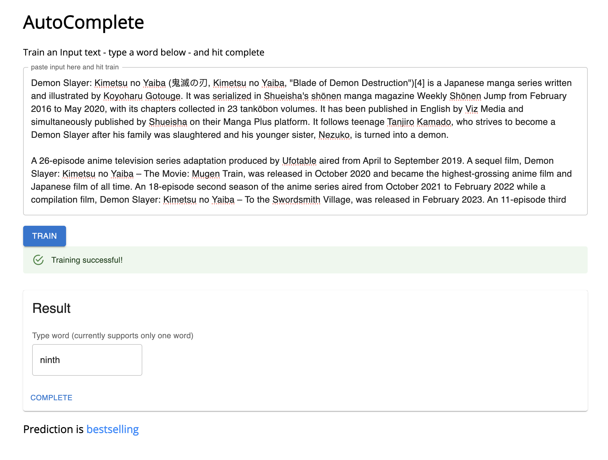

# AutoComplete UI

This UI provides the front end functionality for the [AutoComplete](https://github.com/Xceptions/AutoComplete/) project I did

How it looks


- Run using npm

```
npm run dev
```
